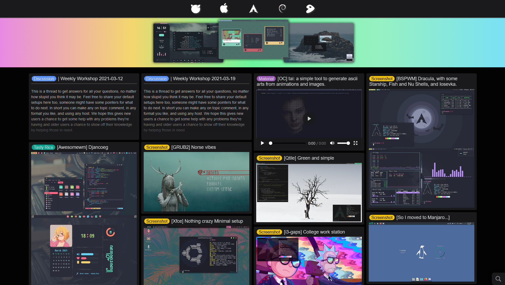

<p align="center">
  
  <h1 align="center">Evil-Reddit</h1>
</p>

## Overview
🚧 Work In Progress 🚧

Self hosted reddit viewer created to replace slow and bloated [reddit.com](https://www.reddit.com) with something harder, better, faster, stronger.  
It's meant to be customized, if you don't like something - change it.



## Usage

Clone repository and visit web directory
```
yarn install
yarn build
```
 

Start server from root directory
```
go run main.go
```

Open browser and visit `127.0.0.1:3006/r/unixporn`, enjoy.

Edit `web/config.json` according to your environment.

Go server is just an example, if you don't want to install go, write your own.  
Just make sure that all `/r/*` requests are redirected to `web/reddit.html`

## Troubleshooting
Developed and tested in Firefox for 1920x1080 resolution.

If something doesn't work - lookup console messages in browser tools, it should help you identify the problem

  * Cross-Origin Request Blocked - Firefox ? Disable enhanced tracking protection for page (Don't disable uBlock Origin or any other adblock extension, or else iframes will eat your firstborn)

  * GIFs doesn't play - Allow browser to autoplay videos, all gifs are replaced with videos for performance and traffic reasons.

  * Can't play videos - Chromium ? It blocks controls if element doesn't have url in src, can be bypassed with custom controls, working on it.
